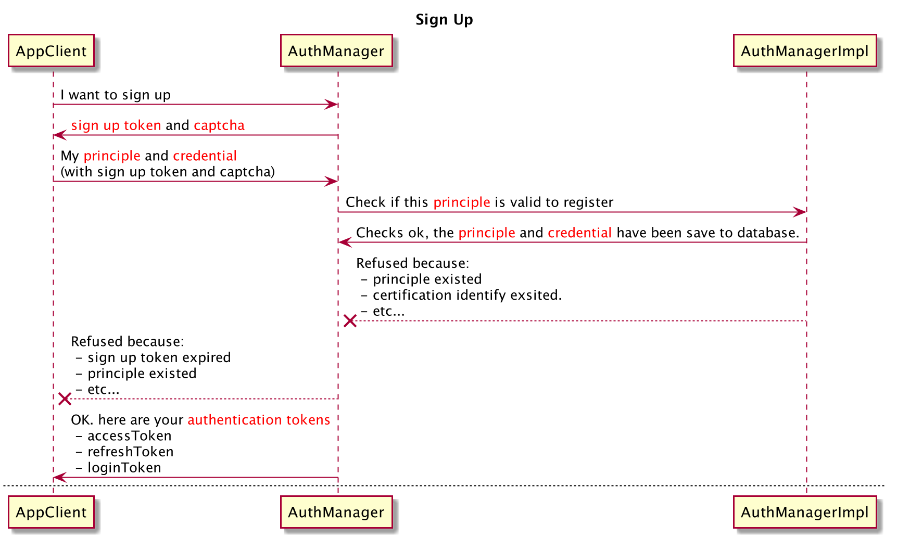
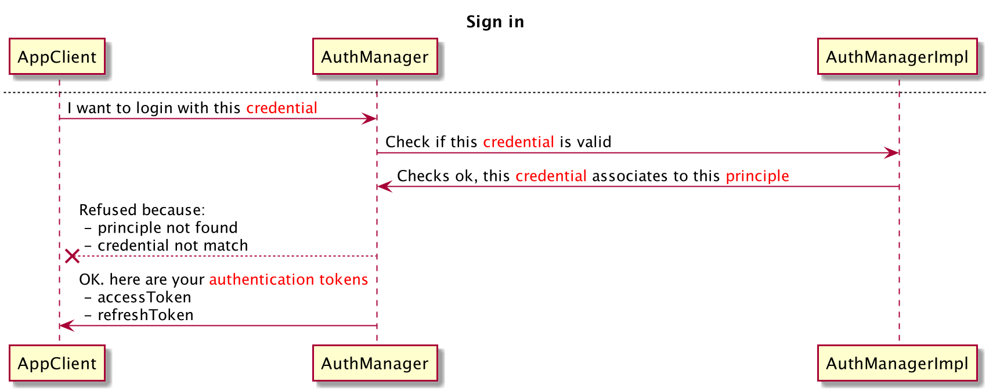
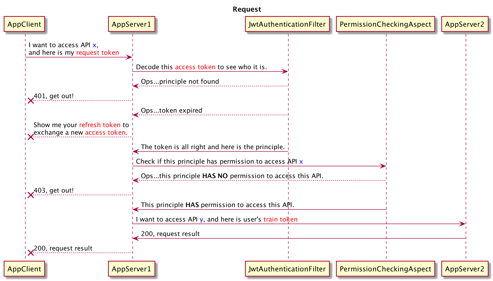

Skr project is a Spring Boot/Cloud project skeleton that define abstraction 
of JWT based security configuration.
Project based on skr skeleton could define its own implementation

## Feature
* JWT based security abstraction
* Modular registration abstraction
    * Permission registration
    * EndPoint registration
* Spring Boot Starter 
* Switchable Spring Cloud platform
    * [Self-Setup Spring Cloud](https://spring.io/projects/spring-cloud)
    * [Tencent TSF](https://cloud.tencent.com/product/tsf)
    
## How to run (as micro-service)
* Start skr-demo-auth
* Start skr-demo-perm
* Start skr-demo-a
* Start skr-demo-b
    
## Authentication flows

## Terminology
* Principal
    * UserPrincipal
    * JwtPrincipal
* Certification
* Tokens
    * access-token:
    * refresh-token:
    * login-token:
    * robot-token:
    * train-token:

## Auth Service
TBD

## Registry Service
TBD

## Switch Spring Cloud provider
TBD

## Convention

#### Exception
* [ErrorInfo](skr-common/src/main/java/org/skr/common/exception/ErrorInfo.java)
* [AuthException](skr-common/src/main/java/org/skr/common/exception/AuthException.java)
* [BizException](skr-common/src/main/java/org/skr/common/exception/BizException.java)
* [ConfException](skr-common/src/main/java/org/skr/common/exception/ConfException.java)

## Test
### Python测试命令
#### unittest 支持用例自动（递归）发现：
* 默认发现当前目录下所有符合 test*.py 测试用例
    * 使用 python -m unittest 或 python -m unittest discover
* 通过 -s 参数指定要自动发现的目录， -p 参数指定用例文件的名称模式
    * python -m unittest discover -s project_directory -p "test_*.py"
* 通过位置参数指定自动发现的目录和用例文件的名称模式
    * python -m unittest discover project_directory "test_*.py"
    
#### unittest 支持执行指定用例：
* 指定测试模块
    * python -m unittest test_module1 test_module2
* 指定测试类
    * python -m unittest test_module.TestClass
* 指定测试方法
    * python -m unittest test_module.TestClass.test_method
* 指定测试文件路径（仅 Python 3）
    * python -m unittest tests/test_something.py

